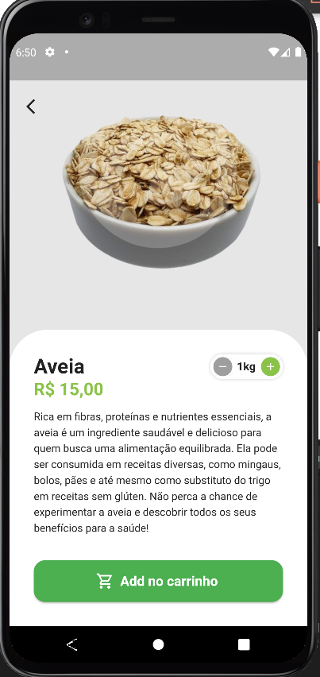
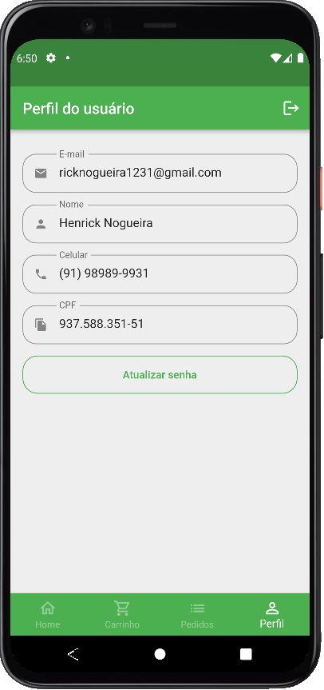

<h1 align="center">
   
</h1>

<h4 align="center"> 
	🚧 Greengrocer 🚀 Concluido...  🚧
</h4>

## ✅ Funções

- <h3>Gerenciamento de Usuários:</h3>

  - [x] Login
  - [x] Cadastro
  - [x] Recuperar Senha

- <h3>Home</h3>

  - [x] Visualizar Produtos
  - [x] Visualizar detalhes do produto

- <h3>Perfil</h3>

  - [x] Editar Perfil

- <h3>Carrinho</h3>

  - [x] Lista produtos
  - [x] Concluir pedido

## 📚 Descrição

- Esse aplicativo foi desenvolvido para gestão de uma quitanda de frutas.

## 🛠 Tecnologias

As seguintes ferramentas foram usadas na construção do projeto:

-  [Flutter](https://flutter.dev/?gclid=Cj0KCQjwkbuKBhDRARIsAALysV4sMSKWcOxrlBmdtlCcf3MAfNdH1ehbbWi6ZjjjdypPLsSvdTFiqOYaAon3EALw_wcB&gclsrc=aw.ds)
-  [Dart](https://dart.dev/)

## 📱 Plataforma adotada

- Android;
- iOS;

## 📸 Screenshot

	
	
	

	
	
	

 
	
	
	

